# Client Journey Record: Audit -> WaaS -> Live Website

## Purpose
This document records the full client journey implemented in this repository, from public SEO audit intake to a deployed live website.

Use it for:
- Sales to delivery handoff
- Operations runbooks
- QA validation of the end-to-end path
- Client lifecycle tracking and post-launch support

## Journey At A Glance

```mermaid
flowchart LR
  A[Prospect starts audit] --> B[Audit runs and report generated]
  B --> C[Get Started CTA to onboarding]
  C --> D[WaaS onboarding steps 1-5]
  D --> E[Initial site generated and review token issued]
  E --> F[Admin command center review and edits]
  F --> G[Client review and variant selection]
  G --> H[Deploy readiness checks]
  H --> I[Deploy to active site]
  I --> J[Live tenant site + post-launch updates]
```

## Stage 1: Audit Intake (Prospect Entry)
Primary touchpoints:
- Public entry page: [app/audit/start/page.tsx](app/audit/start/page.tsx)
- Audit start form: [app/audit/start/audit-start-form.tsx](app/audit/start/audit-start-form.tsx)
- Run endpoint: [app/api/audit/run/route.ts](app/api/audit/run/route.ts)

What happens:
1. Prospect submits target URL and optional competitor URLs.
2. System validates and normalizes URLs.
3. Audit job is created and status starts as pending/running.

Key persisted data:
- Audit record with target_url, competitor_urls, status, and report payload lifecycle.

## Stage 2: Audit Results and Conversion to Onboarding
Primary touchpoints:
- Audit report page: [app/audit/[auditId]/page.tsx](app/audit/[auditId]/page.tsx)
- Report client view: [app/audit/[auditId]/client.tsx](app/audit/[auditId]/client.tsx)
- Lead capture endpoint: [app/api/audit/leads/route.ts](app/api/audit/leads/route.ts)

What happens:
1. Prospect views report details and score breakdown.
2. Prospect can submit lead details.
3. Get Started CTA sends prospect into onboarding with audit context.

Audit lifecycle states:
- pending -> running -> completed
- failure path: failed
- retention path: expired

## Stage 3: WaaS Onboarding (Audit Context -> Tenant Creation)
Primary touchpoints:
- Onboarding UI: [app/get-started/onboarding-flow.tsx](app/get-started/onboarding-flow.tsx)
- Onboarding actions: [lib/waas/actions/onboarding/steps-1-3.ts](lib/waas/actions/onboarding/steps-1-3.ts)
- Final onboarding actions: [lib/waas/actions/onboarding/steps-final.ts](lib/waas/actions/onboarding/steps-final.ts)

Step-by-step flow:
1. Step 1 Business Identity
- Creates or updates tenant record.
- Seeds brand_config and pre-fills from audit where available.
- Sets tenant status to onboarding.

2. Step 2 Domain Wishlist
- Persists requested domain options.
- Stores fallback wishlist in brand_config for schema-safe compatibility.

3. Step 3 Brand Identity
- Saves logo, primary/secondary colors, and visual identity fields.

4. Step 4 Template Selection
- Persists client_selected_template_slug in tenant_site_config.

5. Step 5 Integrations and Final Submit
- Saves Calendly/USP/content/functionality preferences.
- Marks onboarding completed.
- Transitions tenant status to pending_review.
- Generates/ensures client review token.
- Triggers initial site generation.

Tenant status transition at this stage:
- onboarding -> pending_review

## Stage 4: Initial Site Generation
Primary touchpoints:
- Initial site generator: [lib/waas/services/generate-initial-site/index.ts](lib/waas/services/generate-initial-site/index.ts)
- Onboarding final trigger: [lib/waas/actions/onboarding/steps-final.ts](lib/waas/actions/onboarding/steps-final.ts)

What happens:
1. Tier 1 deterministic build runs synchronously.
2. Tier 2 AI enhancement is dispatched asynchronously when available.
3. Base config, sections, and review variants are prepared for admin/client review.

## Stage 5: Admin Command Center and Operations
Primary touchpoints:
- Admin dashboard list: [app/admin/dashboard/page.tsx](app/admin/dashboard/page.tsx)
- Tenant detail workspace: [app/admin/dashboard/[tenantId]/page.tsx](app/admin/dashboard/[tenantId]/page.tsx)
- Domain management: [app/admin/dashboard/domain-requests/page.tsx](app/admin/dashboard/domain-requests/page.tsx)
- Admin action modules: [lib/waas/actions/admin/index.ts](lib/waas/actions/admin/index.ts)

What ops manages here:
1. Queue triage for pending/onboarding tenants.
2. Site settings updates (SEO, OG, custom CSS, section order).
3. Domain request handling.
4. Version history and rollback management.
5. Issuing or validating client review links.

## Stage 6: Client Review and Collaborative Iteration
Primary touchpoints:
- Review page: [app/review/[tenantId]/page.tsx](app/review/[tenantId]/page.tsx)
- Client edit portal: [app/edit/[reviewToken]/page.tsx](app/edit/[reviewToken]/page.tsx)
- Review actions: [lib/waas/actions/admin/client-review.ts](lib/waas/actions/admin/client-review.ts)
- Client edit actions: [lib/waas/actions/client-edit/index.ts](lib/waas/actions/client-edit/index.ts)

What happens:
1. Client opens tokenized review session.
2. Client compares variants and selects preferred direction.
3. Client submits structured feedback and/or mix instructions.
4. Admin/client run iterative regeneration and edits.
5. Version entries are written for traceability.

Variant lifecycle states:
- generated -> sent_to_review -> selected

## Stage 7: Deploy Readiness and Go-Live Decision
Primary touchpoints:
- Readiness and deploy actions: [lib/waas/actions/admin/deploy.ts](lib/waas/actions/admin/deploy.ts)
- Deploy UI trigger: [app/admin/dashboard/[tenantId]/deploy-site-button.tsx](app/admin/dashboard/[tenantId]/deploy-site-button.tsx)

Readiness gate checks include:
1. Template linked
2. Meta title minimum quality
3. Meta description minimum quality
4. Core sections enabled
5. Custom CSS budget
6. Section count guard
7. OG image warning
8. Contact hook presence (Calendly/phone/email)

Deploy rule:
- Any fail blocks deploy.
- Warn does not block deploy.

## Stage 8: Deployment and Activation
Primary touchpoints:
- Deploy action: [lib/waas/actions/admin/deploy.ts](lib/waas/actions/admin/deploy.ts)
- Tenant runtime route: [app/_sites/[site]/page.tsx](app/_sites/[site]/page.tsx)
- Tenant layout/runtime context: [app/_sites/[site]/layout.tsx](app/_sites/[site]/layout.tsx)
- Middleware resolver: [middleware.ts](middleware.ts)

What happens on deploy:
1. Tenant status is set to active.
2. Deployment URL and deployed_at are recorded.
3. Selected variant can be promoted to active sections.
4. Deployment snapshot record is inserted when schema is present.
5. Initial SEO keywords may be auto-generated if missing.

Tenant status transition at this stage:
- pending_review -> active

## Stage 9: Live Runtime and Post-Launch Operations
Primary touchpoints:
- Tenant site rendering: [app/_sites/[site]/page.tsx](app/_sites/[site]/page.tsx)
- SEO routes: [app/_sites/[site]/sitemap.xml/route.ts](app/_sites/[site]/sitemap.xml/route.ts) and [app/_sites/[site]/robots.txt/route.ts](app/_sites/[site]/robots.txt/route.ts)
- Client portal ongoing edits: [app/edit/[reviewToken]/page.tsx](app/edit/[reviewToken]/page.tsx)

Ongoing lifecycle:
1. Client or admin can continue content edits and regeneration.
2. Domain and billing changes can be managed over time.
3. Additional deploys can be executed with new snapshots.
4. Rollbacks remain available through version history.

## Canonical Status Model
Tenant statuses:
- onboarding
- pending_review
- active
- suspended
- cancelled

Audit statuses:
- pending
- running
- completed
- failed
- expired

Source of truth:
- [lib/waas/types.ts](lib/waas/types.ts)

## Ownership Model (Recommended)
1. Marketing/Prospect
- Owns audit submission and initial conversion.

2. Delivery Onboarding
- Owns onboarding completion quality and intake completeness.

3. Admin Ops
- Owns template quality, readiness checks, and deploy decision.

4. Client Stakeholder
- Owns final review direction and approval.

5. Support/Success
- Owns post-launch edits, issue triage, and ongoing optimization.

## Per-Client Recording Template
Use this block per client rollout.

Client metadata:
- Business name:
- Primary contact:
- Audit ID:
- Tenant ID:
- Review token issued:
- Package tier:

Journey checkpoints:
1. Audit submitted at:
2. Audit completed at:
3. Lead captured at:
4. Onboarding started at:
5. Onboarding completed at:
6. Initial site generated at:
7. Client selected variant at:
8. Readiness passed at:
9. Deployed at:
10. Live URL:

Readiness notes:
- Blocking checks resolved:
- Warning checks accepted:

Post-launch notes:
- First-week edits:
- Domain/connectivity issues:
- SEO follow-ups:
- Billing/support actions:

## QA Evidence Checklist For This Journey
Reference suites and cases:
- [COMPREHENSIVE_AUDIT_WAAS_TEST_PLAN.md](COMPREHENSIVE_AUDIT_WAAS_TEST_PLAN.md)
- [AUDIT_WAAS_TEST_EXECUTION_SHEET.md](AUDIT_WAAS_TEST_EXECUTION_SHEET.md)
- [WAAS_ADMIN_TEST_RUN_CHECKLIST.md](WAAS_ADMIN_TEST_RUN_CHECKLIST.md)

Minimum pass set before launch:
1. Audit core path passes (start, complete, report visible)
2. Onboarding steps persist correctly
3. Review token session works
4. Variant selection persists
5. Deploy readiness has no blockers
6. Deploy succeeds and tenant resolves on runtime route
